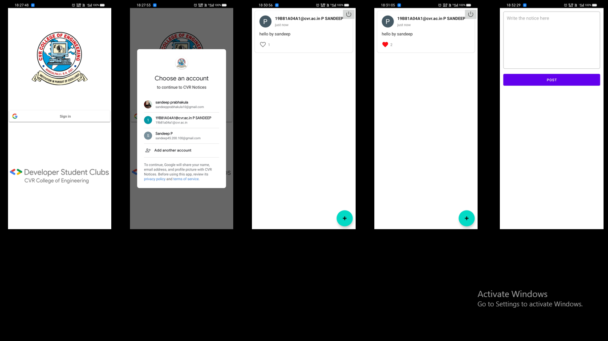

#Android-Study-Jams

College notices to all

Problem Statement:

Sometimes students may not get notified about some events and occasions conducting in the college, and some events are more precious for some students.
Students might lose their opportunities due to some miscommunications which may leave the regret throughout their life.
Technology plays a major role in day-to-day life and can make great alterations in these situations out of all technologies. Mobile app can be effectively used in this situation.

Proposed Solution:

This app proposes a “Notices notifying system” to keep an eye over the events and circulars happening in the college. Here anyone can post their views and also can forward the news known to one. The notices get updated in the app in realtime.

Functionality & Concepts used:

•	RecyclerView : To present the list of different route busses we used the efficient recyclerview.

•	Constraint Layout: Most of the activities in the app uses a flexible constraint layout, which is easy to handle for different screen sizes.

•	Simple & Easy Views Design: Use of familiar audience EditText with hints and interactive buttons made it easier for students to register or sign in without providing any detailed instructions pages. Apps also uses App Navigation to switch between different screens.

•	Firebase Firestore: Making the note of registered users and the posts posted by the users and also displaying the data into the app.

•	Coroutines: To make the UI interactive coroutines are used where the main issue of UI blocking or main thread blocking does not occur.

•	Jetpack Navigation: Since it is a single activity app with multiple screens navigation component is used to navigate from one fragment to another fragment.

Application Link & Future Scope :

The app is currently in the testing phase with CVR College of Engineering with a limited no. of users, You can access the app : https://drive.google.com/file/d/1tvK0Cas29Ewo8YvOPcccBA8R4FBnkivm/view?usp=sharing

Once the app is fully tested and functional in CVR College of Engineering, we plan to talk to neighboring colleges also to propose this app idea and collaborate with them on this.
